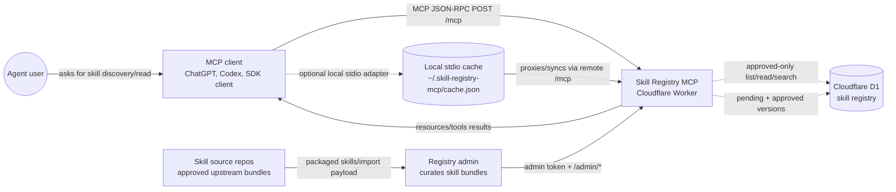
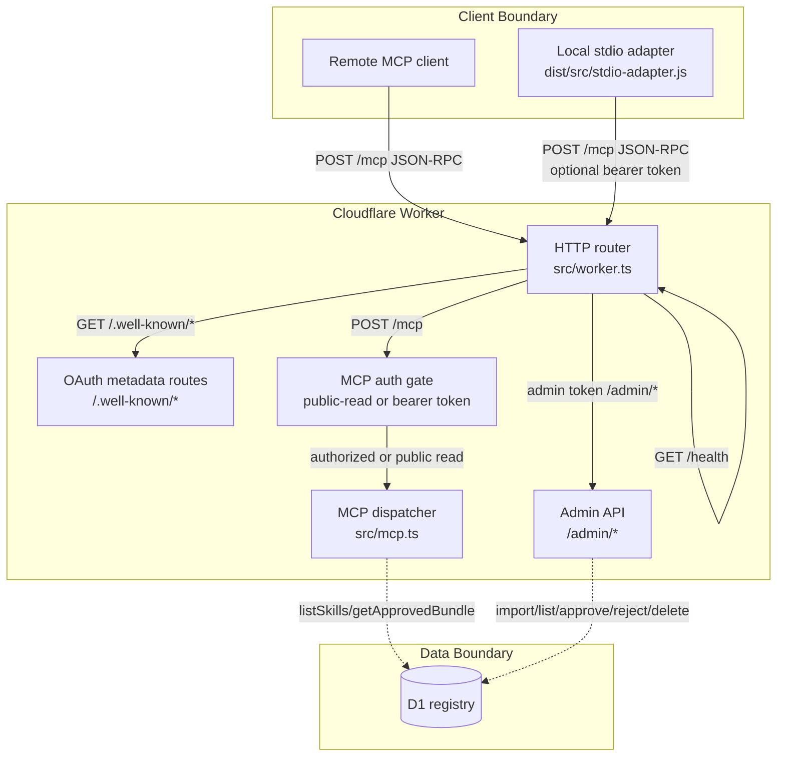
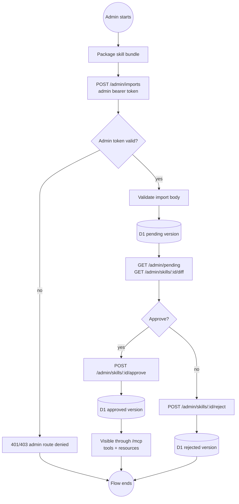

# Skill Registry MCP Flow Chart

Endpoint: `https://skill-registry-mcp.jrice.workers.dev/mcp`

This document combines C4 context notation with BPMN-lite flow semantics. It is intentionally scoped to the current V1 Worker: public approved-read MCP, private bearer-read MCP, admin-only imports/review, and D1-backed approved skill storage.

## BPMN-Lite Legend

```text
((event))      Start/end event
[task]         Activity or service task
{gateway}      Decision
[(store)]      Data store
-- message --> Cross-boundary request/response
-. data .->    Data lookup or write
```

## C4 Context



## C4 Container View



## BPMN-Lite: MCP Read Flow

```mermaid
flowchart TB
  start((MCP client starts))
  postInit["POST /mcp<br/>JSON-RPC initialize"]
  route["Worker routes request"]
  methodCheck{HTTP method is POST?}
  publicRead{SKILL_REGISTRY_MCP_PUBLIC_READ true?}
  bearer{Valid read/admin bearer token?}
  authError["Return 401<br/>WWW-Authenticate resource metadata"]
  parse{Valid JSON-RPC?}
  dispatch["Dispatch MCP method"]
  init["initialize<br/>return protocolVersion 2025-06-18<br/>tools/resources capabilities"]
  listTools["tools/list<br/>return list_skills, get_skill,<br/>search_skills, sync_skills"]
  listResources["resources/list<br/>return skills:// resources"]
  callTool["tools/call<br/>query approved skills only"]
  readResource["resources/read<br/>return approved skill markdown"]
  d1[("D1 registry<br/>approved skills")]
  response["Return JSON-RPC result"]
  end((Client receives result))

  start --> postInit --> route --> methodCheck
  methodCheck -- "no" --> methodError["405 MCP endpoint expects JSON-RPC POST"] --> end
  methodCheck -- "yes" --> publicRead
  publicRead -- "yes" --> parse
  publicRead -- "no" --> bearer
  bearer -- "no" --> authError --> end
  bearer -- "yes" --> parse
  parse -- "no" --> parseError["JSON-RPC parse error -32700"] --> end
  parse -- "yes" --> dispatch
  dispatch --> init --> response
  dispatch --> listTools --> response
  dispatch --> listResources
  listResources -.->|"listSkills approvedOnly"| d1
  listResources --> response
  dispatch --> callTool
  callTool -.->|"list/search/get approvedOnly"| d1
  callTool --> response
  dispatch --> readResource
  readResource -.->|"getApprovedBundleByUri"| d1
  readResource --> response
  response --> end
```

## BPMN-Lite: Admin Approval Flow



## Live Probe Evidence

Observed on 2026-06-03 against `https://skill-registry-mcp.jrice.workers.dev/mcp`:

```text
GET /mcp
  405 Method Not Allowed

POST /mcp initialize
  200 OK
  serverInfo.name = skill-registry-mcp
  serverInfo.version = 0.1.0
  protocolVersion = 2025-06-18
  capabilities = tools, resources

POST /mcp tools/list
  tools = list_skills, get_skill, search_skills, sync_skills

POST /mcp resources/list
  returned approved skills:// resources
```

## Design Notes

- `/mcp` is a JSON-RPC transport endpoint, not a REST browse endpoint.
- Public read mode means approved skills are public content; it does not authenticate a ChatGPT user, email, workspace, or organization.
- Pending imports and review actions stay behind `/admin/*`.
- The read surface is intentionally approved-only: `listSkills({ approvedOnly: true })`, `getApprovedBundle`, and `getApprovedBundleByUri`.
- Full OAuth login is not claimed unless issuer and authorization/token endpoints are configured and validated with a target MCP client.
